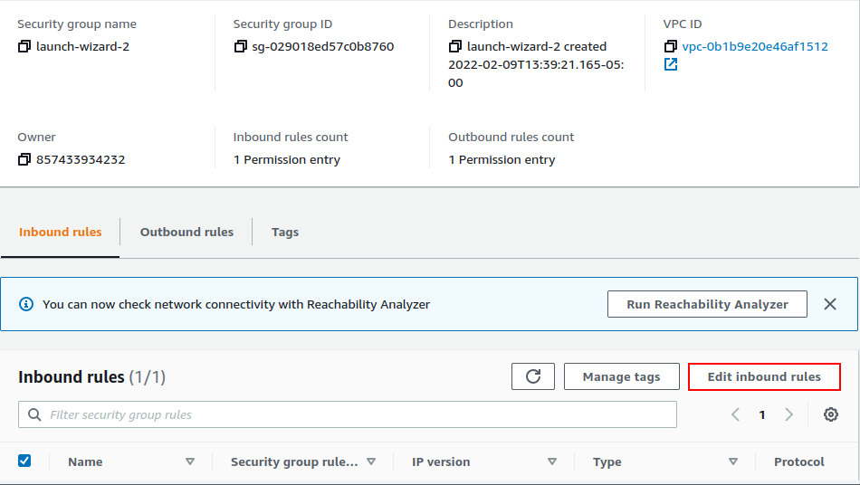
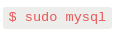

# Web Stack Implementation- LEMP
WEB STACK IMPLEMENTATION (LEMP STACK)

### What is LEMP STACK?
LEMP is a variation of the ubiquitous LAMP stack used for developing and deploying web applications. Traditionally, LAMP consists of Linux, Apache, MySQL, and PHP. Due to its modular nature, the components can easily be swapped out. With LEMP, Apache is replaced with the lightweight yet powerful Nginx.

* LEMP  stands for Linux, Nginx, MySQL, PHP or Python, or Perl.

**Linux**  
Linux is the operating system. It is popular in part because it offers more flexibility and configuration options than some other operating systems. Two of the most commonly used Linux distributions in LEMP stacks are Debian and Ubuntu.

**Nginx**  
Nginx is an open source reverse proxy server for HTTP, HTTPS, SMTP, POP3, and IMAP protocols. It also functions as a load balancer, HTTP cache, and web server (origin server). It has a strong focus on high concurrency, high performance and low memory usage. 

**MySQL**  
MySQL is an open source relational database management system for storing application data. It is also suitable for running even large and complex websites.

**PHP**  
PHP is the programming language.  It is an open source scripting language that works with Apache to help developers create dynamic web pages.

### Prerequisites

As the tittle indicates, this project will be deploy in the AWS Cloud platform.  An AWS account and a virtual server with Ubuntu Server OS must setup.
AWS is one the major Cloud Service Providers, and it provides a free virtual server called EC2 stands for Elastic Computer Cloud.  
These screenshots below will show the followings:

Create an AWS account

Search for EC2

Select the AMI: Ubuntu Server 20.25 LTS

Select a key pair: No need to create a new key pair, use the existing key pair from Project 1. Remember, one key pair can be used for multiple EC2 instances.

Connect EC2 to your local machine

### Installing Nginx Web Server

* The Nginx is a high performance web server which will help to display web pages. The use of apt package is crucial to install the Nginx web server. 

Execute the following commands to install Nginx

To verify that nginx was successfully installed and is running as a service in Ubuntu, run the following command:

If it is green and running, meaning the Web Server has launched successfully.

In order to receive and traffic by our Web Server, it is important to open TCP port 80 which is that default part that web browsers use to access web pages in the internet. 

To test how our Nginx server can respond to requests from the Internet. Open a web browser of your choice and try to access following url: 

### Installing MySql

Now that the Nginx web server is up and running, you need to install a Database Management System (DBMS). MySQL is an open source relational database management system for storing application data. This particular database system is very suitable for this project.  

Start the interactive script by running this command:

Request for the VALIDATE PASSWORD PLUGIN configuration.

For the rest of the questions, press Y and hit the ENTER key at each prompt.

test if you’re able to log in to the MySQL console by typing:

To exit the MySQL console, type:

The MySQL server is now installed and secured.

### Installing PHP

At this point, the Nginx installed to serve the content and MySQL installed to store and manage the data. Next step is to install PHP which will process code and generate dynamic content for the web server.

While Apache embeds the PHP interpreter in each request, Nginx requires an external program to handle PHP processing and act as a bridge between the PHP interpreter itself and the web server. This allows for a better overall performance in most PHP-based websites, but it requires additional configuration.
Combination of the php-fpm and php-mysql package require.  However it can be combine as one such as : 

The PHP components are now installed.

### Configuring Nginx to Use PHP Processor

When using the Nginx web server, we can create server blocks (similar to virtual hosts in Apache) to encapsulate configuration details and host more than one domain on a single server. In this project, projectLEMP will be used as domain name example.

Create the root web directory for your_domain as follows:

then assign ownership of the directory with the $USER environment variable: 

Next, open a new configuration file in Nginx’s sites-available

Activate your configuration by linking to the config file from Nginx’s `sites-enabled` directory:

Test configuration for syntax errors 

Open the website URL using IP address: 

A temporary landing page of the web application is now created

### Testing PHP with Nginx

LEMP stack should now be completely set up.

At this point testing is important to validate that Nginx can correctly hand .php files off to your PHP processor.

To access the config page on a web browser, enter this following command:

