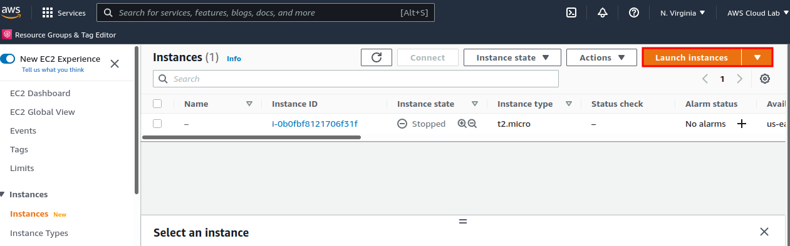

# Web Stack Implementation- LEMP
WEB STACK IMPLEMENTATION (LEMP STACK)

### What is LEMP STACK?
LEMP is a variation of the ubiquitous LAMP stack used for developing and deploying web applications. Traditionally, LAMP consists of Linux, Apache, MySQL, and PHP. Due to its modular nature, the components can easily be swapped out. With LEMP, Apache is replaced with the lightweight yet powerful Nginx.

* LEMP  stands for Linux, Nginx, MySQL, PHP or Python, or Perl.

**Linux**  
Linux is the operating system. It is popular in part because it offers more flexibility and configuration options than some other operating systems. Two of the most commonly used Linux distributions in LEMP stacks are Debian and Ubuntu.

**Nginx**  
Nginx is an open source reverse proxy server for HTTP, HTTPS, SMTP, POP3, and IMAP protocols. It also functions as a load balancer, HTTP cache, and web server (origin server). It has a strong focus on high concurrency, high performance and low memory usage. 

**MySQL**  
MySQL is an open source relational database management system for storing application data. It is also suitable for running even large and complex websites.

**PHP**  
PHP is the programming language.  It is an open source scripting language that works with Apache to help developers create dynamic web pages.

### Prerequisites

As the tittle indicates, this project will be deploy in the AWS Cloud platform.  An AWS account and a virtual server with Ubuntu Server OS must setup.
AWS is one the major Cloud Service Providers, and it provides a free virtual server called EC2 stands for Elastic Computer Cloud.  
These screenshots below will show the followings:

Create an AWS account

Search for EC2

Select the AMI: Ubuntu Server 20.25 LTS

Select a key pair: No need to create a new key pair, use the existing key pair from Project 1. Remember, one key pair can be used for multiple EC2 instances.

Connect EC2 to your local machine

